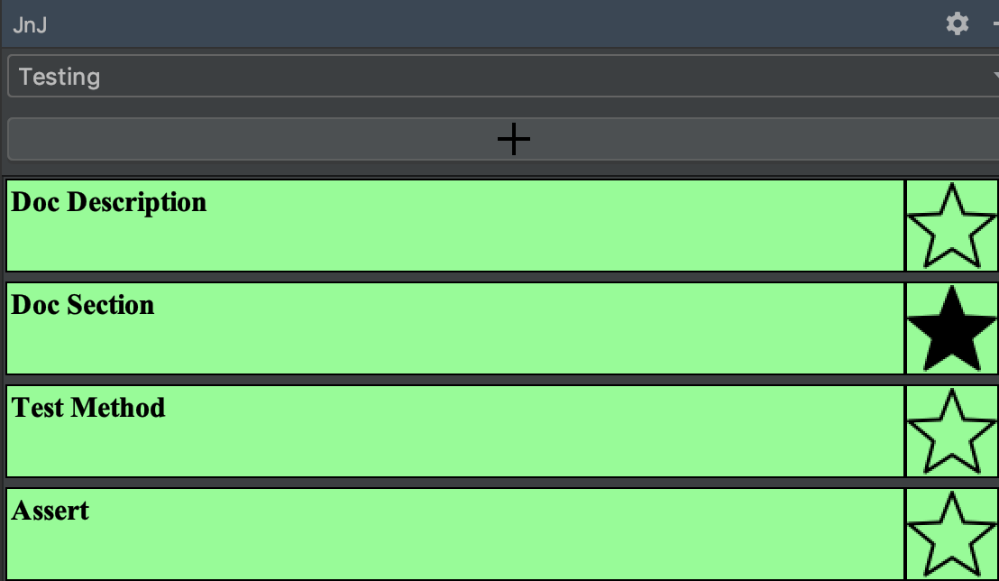
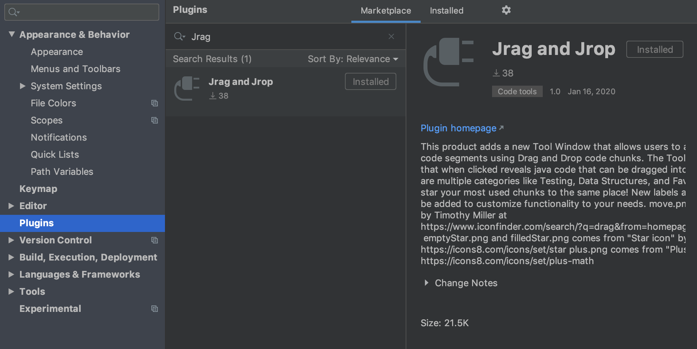
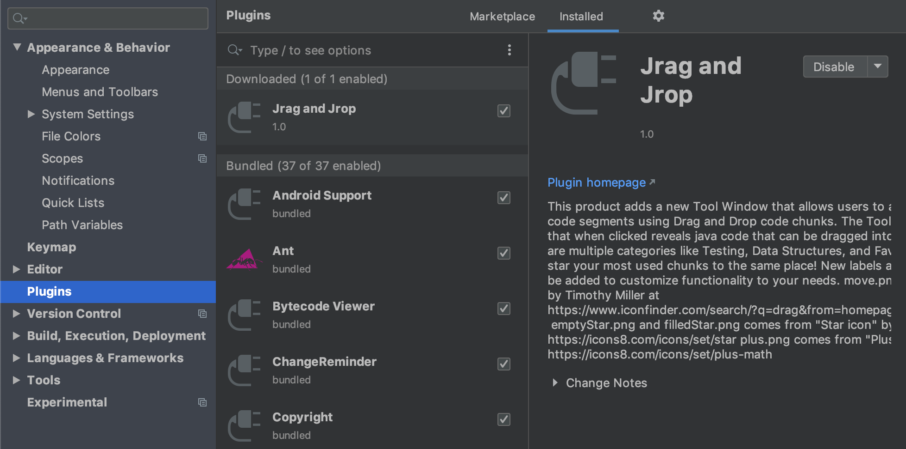

# Jrag and Jrop

A video demo of this project can be found at https://youtu.be/ggRAkXH1YjQ

The goal of this project was to take a feature that is commonly used by younger students (Drag and Drop) and redesign it to 
look and feel like a feature that would be used by more professional programmers. This was accomplished by gathering input from Java developers and interpreting the results into this plug-in which will be user tested. 

### Getting Started 

There are two ways to get this plug-in to work in your own verison of IntelliJ. Both require opening IntelliJ, going to preferences, and selecting plugins.

The first option is to install it from within IntelliJ

The second option is to download the file from the IntelliJ plug-in repository and load it in inside of IntelliJ 

### Built With 

* IntelliJ - IDE

### Authors 

* Kyle Dennison - KyleDennison

